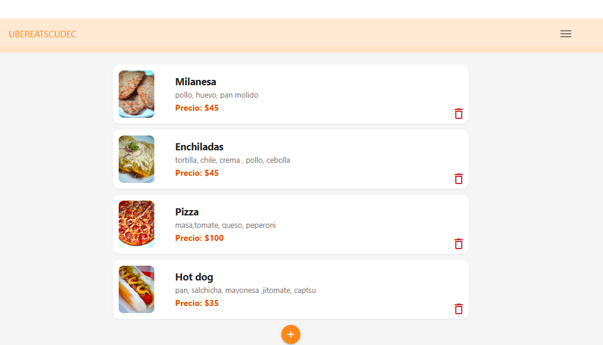
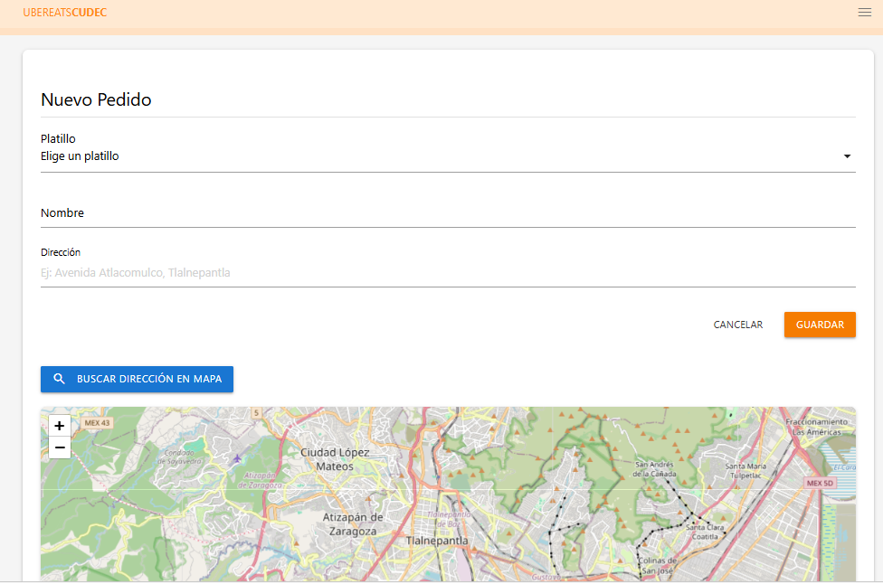
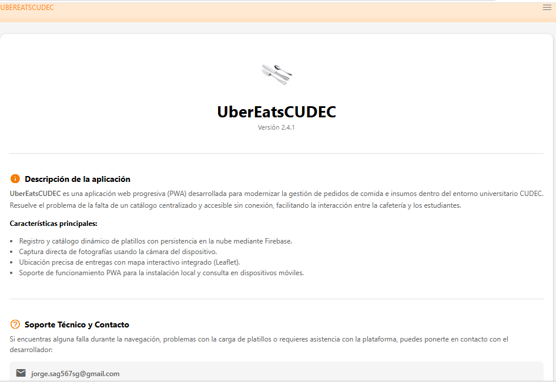

# UberEatsCUDEC - Progressive Web App (PWA)

**Tipo de aplicación:** Progressive Web App (PWA)  
**Descripción:** Aplicación web progresiva orientada al registro y gestión de pedidos de comida con geolocalización e integración de códigos QR.  
**Materia:** Programación Web  
**Carrera:** Ingeniería en Software / Sistemas  
**Alumno:** Jorge Salgado  
**Institución:** Universidad CUDEC  

---

## 2. Descripción del proyecto
UberEatsCUDEC es una solución web accesible desde dispositivos móviles y de escritorio que permite a los usuarios visualizar el menú de platillos, geolocalizar la dirección de entrega mediante mapas interactivos y generar una confirmación de pedido con un código QR único para su fácil seguimiento.

---

## 3. Objetivos

### Objetivo general
Desarrollar una aplicación web progresiva (PWA) funcional e intuitiva para la gestión de pedidos de comida en línea, integrando herramientas de mapas y almacenamiento en tiempo real.

### Objetivos específicos
* Implementar una PWA que pueda instalarse en dispositivos móviles con soporte de Service Worker y Manifiesto.
* Integrar Firebase Firestore para la persistencia de datos de los pedidos.
* Implementar un mapa interactivo con Leaflet para la búsqueda y marcación de direcciones.
* Generar dinámicamente un código QR con la información del pedido utilizando la librería `qrcode.js`.

---

## 4. Características principales
* **Inicio e Interfaz Responsive:** Menú lateral adaptativo desarrollado con Materialize CSS.
* **Geolocalización en Mapa:** Búsqueda de direcciones exactas con OpenStreetMap y Leaflet.
* **Persistencia en Tiempo Real:** Guardado automático de pedidos en Firebase Firestore.
* **Generación de QR:** Creación automática de un código QR único tras registrar un pedido.
* **Soporte PWA:** Funcionalidad offline básica y opción de instalación en la pantalla de inicio del dispositivo.

---

## 5. Tecnologías utilizadas
* **Frontend:** HTML5, CSS3, JavaScript (ES6+)
* **Framework CSS:** Materialize CSS (v1.0.0)
* **Mapas:** Leaflet.js (v1.9.4) & OpenStreetMap API
* **Códigos QR:** QRCode.js (v1.0.0)
* **Backend & Base de Datos:** Firebase Firestore (v6.0.1)
* **Control de Versiones y Hosting:** Git, GitHub, GitHub Pages

---

## 6. Estructura del proyecto
UBEREATSCUDEC/
├── css/
│   ├── materialize.min.css
│   └── styles.css
├── iconos/
│   └── icons/
├── img/
├── js/
│   ├── db.js
│   ├── firebase.js
│   ├── materialize.min.js
│   ├── pedidos.js
│   └── qrcode.min.js
├── pages/
│   ├── about.html
│   ├── contact.html
│   └── pedidos.html
├── index.html
├── manifest.json
├── README.md
└── sw.js

---

## 7. Evidencias / capturas de pantalla

### Inicio

### Realizar pedido

### Acerca de

---

## 8. Base de datos
* **Motor utilizado:** Cloud Firestore (Firebase)
* **Colecciones principales:**
  * `pedidos`: Almacena las órdenes enviadas desde el formulario con las propiedades `platillo`, `cliente`, `direccion` y `fecha`.

---

## 9. Licencia
Este proyecto fue desarrollado exclusivamente con fines académicos como parte de la carrera en Universidad CUDEC.